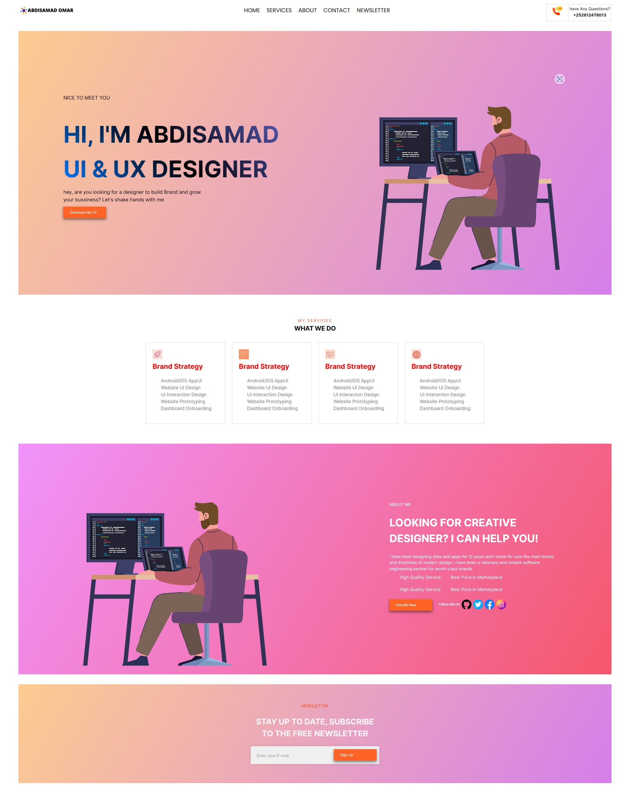

This portfolio project is a simple web application built using HTML, CSS, JavaScript, React, and Vite. It includes various components to display information about me, my skills, and projects I've worked on.
**Brief Description**

* "This simple portfolio website showcases my frontend development skills using HTML, CSS, JavaScript, React, and Vite. It demonstrates my ability to create clean, responsive layouts, implement interactive components, and manage project structure effectively."

**Project Structure**

* **src/**
    * **components/** (Contains reusable React components)
    * **styles/** (Houses CSS or styling solution files)
    * **assets/** (Stores images, fonts, etc.)
    * **App.js**  (Main entry point for the React application)
    * **index.js** (Renders the root component)

## **Technologies Used**

* **Core:**
    * HTML 
    * CSS
    * JavaScript
    * React
    * Vite
* **Other Libraries/Frameworks (if applicable):**
    * Field: ...

## **Live Demo**
[Link to My App](https://abdisamad-portfolio.netlify.app/)

## **Screenshots** 



1. **Prerequisites:**
   * Node.js (version 14.x or later recommended)
   * A code editor or IDE (like Visual Studio Code, Atom, WebStorm)
   * Basic familiarity with the command line/terminal

2. **Cloning the repository:**
   ```bash
   git clone https://github.com/sammyc0d3r/Portfolio-Abdisamad-Omar.git
   ```

3. **Installing dependencies:**
   ```bash
   cd Portfolio-Abdisamad-Omar
   npm install 
   ```

4. **Running the development server:**
   ```bash
   npm run dev 
   ```
   * This will typically start a local development server at `http://localhost:3000` (or a different port, check your terminal output).


**Future Improvements (Optional)**

* **Add animations and transitions:**  Enhance visual appeal and user experience.
* **Implement a routing system:** Create smoother navigation between different sections of the portfolio (if applicable).
* **Incorporate a backend:**  Add dynamic content management or contact form functionality (if desired).


**Explanations of Improvements:**

* **Specific Node.js version:** Recommending at least version 14.x ensures compatibility with modern JavaScript features and Vite's own requirements.
* **Code editor:**  Reminding users they need a place to work on the code is helpful for absolute beginners.
* **Command line familiarity:** A quick note that users should have some basic understanding of the terminal.
* **Development server URL:** Most react projects default to `localhost:3000`, so it's worth mentioning.

**Additional Considerations:**

* **npm vs. yarn:** Briefly mention that yarn can be used as an alternative package manager if the user prefers.
* **Troubleshooting:**  Consider adding a short "Troubleshooting" section in case a user encounters common setup issues. 


## License

This project is licensed under the MIT License. You are free to use, modify, and distribute the code for personal or commercial purposes, provided you include the copyright notice and license terms. 
resources like:
    * [https://opensource.org/licenses/MIT](https://opensource.org/licenses/MIT)
    * [https://choosealicense.com/licenses/mit/](https://choosealicense.com/licenses/mit/)

**Contributions**

* "I welcome feedback and suggestions for improvement. If you'd like to contribute, please submit a pull request with clear explanations of your changes."
Absolutely! Let's craft a comprehensive README file for your simple portfolio project. Here's the basic structure, and I'll prompt you for details as needed:

